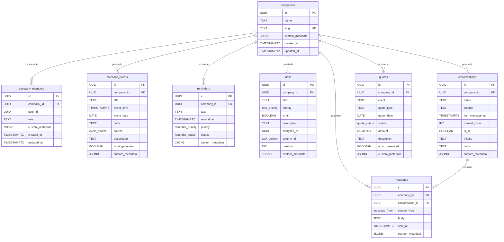

# Documentazione Schema Database — Segretaria AI

> **Versione schema:** `20260715214055_init_saas_core`
> **Target:** Supabase (PostgreSQL 15+)
> **Architettura:** SaaS B2B Multitenant con Row Level Security

---

## Indice

1. [Panoramica Architetturale](#1-panoramica-architetturale)
2. [⚠️ Vendor Lock-in e Assenza di ORM — Problema Critico](#2-️-vendor-lock-in-e-assenza-di-orm--problema-critico)
3. [File di Migrazione SQL](#3-file-di-migrazione-sql)
   - [Sezione 0 — Estensioni](#sezione-0--estensioni)
   - [Sezione 1 — Funzione Helper `set_updated_at()`](#sezione-1--funzione-helper-set_updated_at)
   - [Sezione 2 — Tipi Enum](#sezione-2--tipi-enum)
   - [Sezione 3 — Tabelle](#sezione-3--tabelle)
   - [Sezione 4 — Row Level Security] (#sezione-4--row-level-security)    
   - [Sezione 5 — Funzione Helper `get_my_company_ids()`](#sezione-5--funzione-helper-get_my_company_ids)
   - [Sezione 6 — Policy RLS](#sezione-6--policy-rls)
   - [Stato Obiettivo 3 — Sicurezza RLS](#stato-obiettivo-3--sicurezza-rls)
   - [Analisi Principio del Minimo Privilegio](#3d--analisi-del-principio-del-minimo-privilegio-least-privilege)
4. [File TypeScript `supabase.ts`](#4-file-typescript-supabasets)
   - [Tipo `Json`](#tipo-json)
   - [Tipo `Database`](#tipo-database)
   - [Helper Types Generici](#helper-types-generici)
   - [Oggetto `Constants`](#oggetto-constants)
5. [Diagramma Relazionale (ER)](#5-diagramma-relazionale-er)
6. [Pattern Comuni di Utilizzo nel Frontend](#6-pattern-comuni-di-utilizzo-nel-frontend)
7. [Manutenzione e Rigenerazione dei Tipi](#7-manutenzione-e-rigenerazione-dei-tipi)

---

## 1. Panoramica Architetturale

Il sistema è progettato come un **SaaS B2B multitenant** dove ogni cliente aziendale (tenant) è rappresentato da un record nella tabella `companies`. Ogni dato di business (eventi, task, messaggi, preventivi, etc.) è collegato al tenant tramite la colonna `company_id`, presente obbligatoriamente su ogni tabella.

L'isolamento dei dati tra tenant è garantito a **livello database** attraverso:

- **Row Level Security (RLS):** ogni query eseguita da un utente autenticato restituisce esclusivamente i record appartenenti alle company di cui è membro.
- **FORCE RLS:** applicato su tutte le tabelle, impedisce anche al table owner (ruolo `postgres`) di bypassare le policy.
- **Funzione `SECURITY DEFINER`:** la funzione `get_my_company_ids()` risolve le company dell'utente corrente bypassando RLS internamente per evitare ricorsione infinita, dato che `company_members` è essa stessa protetta da RLS.

### Mapping Interfacce TypeScript → Tabelle SQL

| Interfaccia TypeScript (sorgente) | File sorgente | Tabella PostgreSQL |
|---|---|---|
| — (infrastruttura tenant) | — | `companies` |
| — (infrastruttura tenant) | — | `company_members` |
| `CalendarEventData` | `app/types/calendar.ts` | `calendar_events` |
| `ReminderData` | `app/types/calendar.ts` | `reminders` |
| `Task` | `app/types/maintenance.ts` | `tasks` |
| `ChatListItem` | `app/types/messaging.ts` | `conversations` |
| `Message` | `app/types/messaging.ts` | `messages` |
| `Quote` | `app/types/quotes.ts` | `quotes` |

---

## 2. ⚠️ Vendor Lock-in e Assenza di ORM — Problema Critico

> [!CAUTION]
> **Questo è attualmente il problema architetturale più grave del progetto.** L'intero data layer è accoppiato a Supabase a 5 livelli distinti. L'assenza di un ORM significa che una futura migrazione verso un altro provider richiederebbe la riscrittura di schema, tipi, query, policy e autenticazione.

### Il problema

Lo stack attuale opera senza alcun layer di astrazione tra il codice applicativo e Supabase:

```
Stato attuale (SENZA ORM):
  Frontend → Supabase JS SDK → Supabase REST API → PostgreSQL
              ↑                  ↑                    ↑
           Proprietario       Proprietario         Standard
           (lock-in)          (lock-in)            (portabile)
```

Ogni componente — dalla definizione delle tabelle, ai tipi TypeScript, alle query, alle policy di sicurezza, al sistema di autenticazione — è implementato con API, funzioni e convenzioni **esclusive di Supabase** che non esistono in nessun altro ecosistema.

### I 5 livelli di accoppiamento

| # | Livello | Cosa è accoppiato | File coinvolti | Portabilità | Sforzo di migrazione |
|---|---|---|---|---|---|
| **L1** | Schema SQL | `CREATE TABLE`, `CREATE TYPE`, FK, indici | [`init_saas_core.sql`](file:///c:/Users/ludov/segretaria/supabase/migrations/20260715214055_init_saas_core.sql) | ✅ PostgreSQL standard | ⚠️ Basso (se si resta su PostgreSQL) |
| **L2** | Policy RLS | 32 policy che usano `auth.uid()`, `auth.jwt()` — **funzioni esclusive di Supabase** | Stesso file SQL, righe 280–457 | 🔴 Non portabile | 🔴 Alto — vanno riscritte tutte da zero |
| **L3** | Tipi TypeScript | `supabase.ts` generato dalla CLI con struttura `Database["public"]["Tables"]` — formato proprietario | [`supabase.ts`](file:///c:/Users/ludov/segretaria/app/types/supabase.ts) | 🔴 Non portabile | 🔴 Alto — va rigenerato con il tool del nuovo provider |
| **L4** | Query applicative | Ogni query usa il client Supabase (`supabase.from('tasks').select(...)`) — API proprietaria | Tutti i file in `app/data/` | 🔴 Non portabile | 🔴 Alto — ogni singola query va riscritta |
| **L5** | Autenticazione | `auth.users`, JWT Supabase, session management, `auth.uid()` | Ovunque ci sia login/signup/auth | 🔴 Non portabile | 🔴 Alto — sistema di auth completamente diverso |

### Impatto concreto: cosa succede se devi migrare

Se domani Supabase cambiasse pricing, fosse acquisita, o il progetto avesse bisogno di un'infrastruttura diversa (es. AWS RDS + Prisma, PlanetScale, Neon), bisognerebbe riscrivere:

| Elemento da riscrivere | Quantità attuale | Complessità |
|---|---|---|
| Definizioni tabelle + enum | 8 tabelle, 7 enum | Media — SQL standard ma vanno adattate al nuovo sistema di migrazione |
| Policy RLS | 32 policy + 1 function | Alta — `auth.uid()` non esiste altrove, bisogna reimplementare l'intero meccanismo di autorizzazione |
| File tipi TypeScript | 1 file, ~574 righe | Media — va rigenerato con il tool dell'ORM target |
| Query nel data layer | Tutti i file in `app/data/` (4 file) | Alta — ogni `supabase.from().select().eq()` va tradotto nella sintassi del nuovo client |
| Sistema di autenticazione | Ogni componente con auth | Alta — JWT, session, user management completamente diversi |

### Cosa risolverebbe un ORM

Un ORM (es. **Drizzle ORM**, **Prisma**, **Kysely**) introduce un layer di astrazione che disaccoppia il codice dal provider:

```
Con ORM:
  Frontend → ORM (Drizzle/Prisma) → Qualsiasi database PostgreSQL/MySQL/SQLite
              ↑
           Astratto, portabile
           (cambi la connection string, non il codice)
```

#### Confronto diretto: con ORM vs. senza ORM

| Elemento | Senza ORM (oggi) | Con ORM |
|---|---|---|
| **Definizione tabelle** | SQL puro nella migrazione + `supabase.ts` generato | Schema definito in TypeScript (es. `drizzle/schema.ts`) → genera SQL per qualsiasi DB |
| **Enum types** | `CREATE TYPE` in SQL + union type in `supabase.ts` | Definiti una volta nello schema ORM → portabili |
| **Query** | `supabase.from('tasks').select('*').eq('status', 'todo')` | `db.select().from(tasks).where(eq(tasks.status, 'todo'))` — funziona su qualsiasi DB |
| **Tipi TypeScript** | Generati dalla CLI Supabase, accoppiati al formato proprietario | Inferiti dallo schema ORM, indipendenti dal provider |
| **Migrazioni** | File SQL manuali | Generate automaticamente dal diff dello schema |
| **Per migrare** | Riscrivere schema, tipi, query, policy, auth | Cambiare la connection string e adattare le migrazioni |

#### Esempio concreto: definizione tabella `tasks`

**Oggi (SQL puro + Supabase SDK):**
```sql
-- Migrazione SQL (non portabile se le policy usano auth.uid())
CREATE TABLE public.tasks (
  id          UUID PRIMARY KEY DEFAULT gen_random_uuid(),
  company_id  UUID NOT NULL REFERENCES companies(id) ON DELETE CASCADE,
  title       TEXT NOT NULL,
  priority    public.task_priority NOT NULL DEFAULT 'medium',
  ...
);
```
```typescript
// Query nel frontend (accoppiata a Supabase)
const { data } = await supabase.from('tasks').select('*').eq('company_id', companyId)
```

**Con Drizzle ORM (portabile):**
```typescript
// Schema definito una volta, genera SQL per qualsiasi DB
import { pgTable, uuid, text, pgEnum } from 'drizzle-orm/pg-core'

export const taskPriority = pgEnum('task_priority', ['high', 'medium', 'low'])

export const tasks = pgTable('tasks', {
  id: uuid('id').primaryKey().defaultRandom(),
  companyId: uuid('company_id').notNull().references(() => companies.id, { onDelete: 'cascade' }),
  title: text('title').notNull(),
  priority: taskPriority('priority').notNull().default('medium'),
  // ...
})
```
```typescript
// Query portabile — funziona con PostgreSQL, MySQL, SQLite
const data = await db.select().from(tasks).where(eq(tasks.companyId, companyId))
```

### Raccomandazione

> [!IMPORTANT]
> **L'introduzione di un ORM (preferibilmente Drizzle ORM per la sua type-safety nativa e il supporto PostgreSQL) è la priorità architetturale più alta del progetto.** Dovrebbe avvenire **prima** di sviluppare ulteriori feature, per evitare di accumulare debito tecnico su un data layer non portabile.
>
> L'integrazione dell'ORM non invalida il lavoro fatto: lo schema SQL attuale, gli enum, e la struttura delle tabelle sono corretti e verranno **tradotti** nello schema ORM 1:1. Le policy RLS resteranno in SQL come layer aggiuntivo di sicurezza a livello database.

### Priorità delle azioni correttive

| Priorità | Azione | Impatto |
|---|---|---|
| 🔴 **P0** | Integrare un ORM (Drizzle/Prisma) e migrare lo schema | Elimina il lock-in su L1, L3, L4 |
| 🔴 **P1** | Implementare policy role-aware (PoLP) | Risolve l'Obiettivo 3 al 100% |
| ⚠️ **P2** | Astrarre il layer di autenticazione | Riduce il lock-in su L5 |
| ⚠️ **P3** | Documentare le policy RLS separatamente dal provider | Riduce il lock-in su L2 |

---

## 3. File di Migrazione SQL

**Percorso:** [`supabase/migrations/20260715214055_init_saas_core.sql`](file:///c:/Users/ludov/segretaria/supabase/migrations/20260715214055_init_saas_core.sql)
**Dimensione:** 462 righe, ~18 KB
**Esecuzione:** automatica via Supabase CLI (`supabase db push` o `supabase migration up`)

Il file è organizzato in 7 sezioni numerate, eseguite sequenzialmente in una singola transazione.

---

### Sezione 0 — Estensioni

```sql
CREATE EXTENSION IF NOT EXISTS "pgcrypto";
```

**Riga:** 10
**Scopo:** Abilita l'estensione `pgcrypto` che fornisce la funzione `gen_random_uuid()`. Questa funzione è usata come valore `DEFAULT` per la colonna `id` (tipo `UUID`) di ogni tabella, generando identificatori univoci v4 senza dipendere dal client.

> [!NOTE]
> Nelle versioni più recenti di PostgreSQL (14+), `gen_random_uuid()` è disponibile nativamente. L'estensione è inclusa per retrocompatibilità.

---

### Sezione 1 — Funzione Helper `set_updated_at()`

```sql
CREATE OR REPLACE FUNCTION public.set_updated_at()
RETURNS TRIGGER AS $$
BEGIN
  NEW.updated_at = now();
  RETURN NEW;
END;
$$ LANGUAGE plpgsql;
```

**Righe:** 15–21
**Tipo:** Trigger function in PL/pgSQL
**Scopo:** Aggiorna automaticamente la colonna `updated_at` al timestamp corrente (`now()`) ad ogni operazione `UPDATE` su un record. Viene collegata a tutte le 8 tabelle tramite trigger `BEFORE UPDATE`, eliminando la necessità di gestire il timestamp lato applicazione.

**Trigger associati** (uno per tabella):

| Trigger | Tabella | Riga |
|---|---|---|
| `trg_companies_updated_at` | `companies` | 69–71 |
| `trg_company_members_updated_at` | `company_members` | 91–93 |
| `trg_calendar_events_updated_at` | `calendar_events` | 116–118 |
| `trg_reminders_updated_at` | `reminders` | 138–140 |
| `trg_tasks_updated_at` | `tasks` | 163–165 |
| `trg_conversations_updated_at` | `conversations` | 187–189 |
| `trg_messages_updated_at` | `messages` | 210–212 |
| `trg_quotes_updated_at` | `quotes` | 235–237 |

---

### Sezione 2 — Tipi Enum

**Righe:** 23–51
**Scopo:** Definisce 7 tipi enumerati PostgreSQL nello schema `public`, mappati 1:1 dalle union type TypeScript dei file sorgente.

| Enum PostgreSQL | Valori | Sorgente TS |
|---|---|---|
| `event_source` | `google_calendar`, `apple_calendar`, `manual`, `ai_secretary` | `EventSource` in `calendar.ts` |
| `reminder_priority` | `high`, `medium`, `low` | `ReminderPriority` in `calendar.ts` |
| `reminder_status` | `active`, `resolved`, `archived` | `ReminderStatus` in `calendar.ts` |
| `task_priority` | `high`, `medium`, `low` | `TaskPriority` in `maintenance.ts` |
| `task_column` | `todo`, `in_progress`, `done` | `ColumnId` in `maintenance.ts` |
| `message_from` | `contact`, `user`, `ai_draft` | `MessageFrom` in `messaging.ts` |
| `quote_status` | `pending_ai`, `quote_sent`, `approved`, `declined` | `QuoteStatus` in `quotes.ts` |

> [!NOTE]
> I valori enum in PostgreSQL usano `snake_case` (es. `in_progress`, `ai_draft`) a differenza dei sorgenti TypeScript che usano `kebab-case` (es. `in-progress`, `ai-draft`). Questa normalizzazione è intenzionale per aderire alle convenzioni PostgreSQL.

---

### Sezione 3 — Tabelle

**Righe:** 53–237

Ogni tabella segue un pattern strutturale comune:

#### Pattern comune a tutte le tabelle

| Colonna | Tipo | Vincoli | Descrizione |
|---|---|---|---|
| `id` | `UUID` | `PRIMARY KEY DEFAULT gen_random_uuid()` | Identificatore univoco autogenerato |
| `company_id` | `UUID` | `NOT NULL REFERENCES companies(id) ON DELETE CASCADE` | Foreign key al tenant (assente solo su `companies` che *è* il tenant) |
| `custom_metadata` | `JSONB` | `NOT NULL DEFAULT '{}'` | Payload JSON flessibile per estensioni future senza migrazioni |
| `created_at` | `TIMESTAMPTZ` | `NOT NULL DEFAULT now()` | Timestamp di creazione, immutabile |
| `updated_at` | `TIMESTAMPTZ` | `NOT NULL DEFAULT now()` | Timestamp ultimo aggiornamento, gestito dal trigger |

> [!IMPORTANT]
> La colonna `company_id` è il pilastro dell'isolamento multitenant. Il vincolo `ON DELETE CASCADE` garantisce che eliminando una company, **tutti i dati correlati vengano eliminati a cascata**, prevenendo record orfani.

---

#### 3a. `companies` — Tenant Root

**Righe:** 60–67 | **Sorgente TS:** Infrastruttura (nessuna interfaccia diretta)

La tabella radice dell'intero sistema multitenant. Ogni record rappresenta un'azienda cliente (tenant).

| Colonna | Tipo | Vincoli | Descrizione |
|---|---|---|---|
| `id` | `UUID` | `PK, DEFAULT gen_random_uuid()` | Identificatore del tenant, referenziato da tutte le altre tabelle |
| `name` | `TEXT` | `NOT NULL` | Nome visualizzato dell'azienda |
| `slug` | `TEXT` | `NOT NULL, UNIQUE` | Identificatore URL-friendly (es. `acme-corp`), univoco globalmente |
| `custom_metadata` | `JSONB` | `NOT NULL DEFAULT '{}'` | Metadati estensibili (es. piano di abbonamento, configurazioni, logo URL) |
| `created_at` | `TIMESTAMPTZ` | `NOT NULL DEFAULT now()` | — |
| `updated_at` | `TIMESTAMPTZ` | `NOT NULL DEFAULT now()` | — |

> [!NOTE]
> `companies` è l'unica tabella **senza** `company_id` perché la sua `id` **è** il `company_id` referenziato da tutte le altre.

---

#### 3b. `company_members` — Tabella Ponte Utenti-Tenant

**Righe:** 76–86 | **Sorgente TS:** Infrastruttura (nessuna interfaccia diretta)

Mappa la relazione N:M tra utenti Supabase Auth (`auth.users`) e company. Un utente può appartenere a più company, e una company può avere più membri.

| Colonna | Tipo | Vincoli | Descrizione |
|---|---|---|---|
| `id` | `UUID` | `PK` | — |
| `company_id` | `UUID` | `NOT NULL, FK → companies(id) ON DELETE CASCADE` | Il tenant di appartenenza |
| `user_id` | `UUID` | `NOT NULL` | L'UUID dell'utente da `auth.users` (valore di `auth.uid()`) |
| `role` | `TEXT` | `NOT NULL DEFAULT 'member'` | Ruolo dell'utente nella company (es. `owner`, `admin`, `member`) |
| `custom_metadata` | `JSONB` | `NOT NULL DEFAULT '{}'` | — |
| `created_at` | `TIMESTAMPTZ` | `NOT NULL DEFAULT now()` | — |
| `updated_at` | `TIMESTAMPTZ` | `NOT NULL DEFAULT now()` | — |

**Vincolo unico:** `UNIQUE (company_id, user_id)` — un utente non può essere membro due volte della stessa company.

**Indici:**
- `idx_company_members_user` su `(user_id)` — ottimizza il lookup dalla funzione RLS `get_my_company_ids()`
- `idx_company_members_company` su `(company_id)` — ottimizza le join per elencare i membri di una company

---

#### 3c. `calendar_events` — Eventi Calendario

**Righe:** 98–111 | **Sorgente TS:** `CalendarEventData` in [`calendar.ts`](file:///c:/Users/ludov/segretaria/app/types/calendar.ts)

| Colonna | Tipo | Vincoli | Descrizione |
|---|---|---|---|
| `id` | `UUID` | `PK` | — |
| `company_id` | `UUID` | `NOT NULL, FK → companies(id) CASCADE` | — |
| `title` | `TEXT` | `NOT NULL` | Titolo dell'evento |
| `event_time` | `TIMESTAMPTZ` | `NOT NULL` | Orario preciso dell'evento con timezone |
| `event_date` | `DATE` | `NOT NULL` | Data dell'evento (usata per query di range e raggruppamento giornaliero) |
| `color` | `TEXT` | `nullable` | Token colore CSS o valore esadecimale per la UI |
| `source` | `event_source` | `NOT NULL DEFAULT 'manual'` | Origine dell'evento (Google Calendar, Apple Calendar, manuale, AI) |
| `description` | `TEXT` | `NOT NULL DEFAULT ''` | Descrizione testuale |
| `is_ai_generated` | `BOOLEAN` | `NOT NULL DEFAULT FALSE` | Flag che indica se l'evento è stato creato dall'AI Secretary |
| `custom_metadata` | `JSONB` | `NOT NULL DEFAULT '{}'` | — |
| `created_at` / `updated_at` | `TIMESTAMPTZ` | — | — |

**Indici:**
- `idx_calendar_events_company` su `(company_id)` — filtro tenant
- `idx_calendar_events_date` su `(company_id, event_date)` — indice composito ottimizzato per query tipo "mostrami gli eventi di questa company in questa data/range"

---

#### 3d. `reminders` — Promemoria

**Righe:** 123–133 | **Sorgente TS:** `ReminderData` in [`calendar.ts`](file:///c:/Users/ludov/segretaria/app/types/calendar.ts)

| Colonna | Tipo | Vincoli | Descrizione |
|---|---|---|---|
| `id` | `UUID` | `PK` | — |
| `company_id` | `UUID` | `NOT NULL, FK CASCADE` | — |
| `text` | `TEXT` | `NOT NULL` | Testo del promemoria |
| `remind_at` | `TIMESTAMPTZ` | `NOT NULL` | Quando il promemoria deve attivarsi |
| `priority` | `reminder_priority` | `NOT NULL DEFAULT 'medium'` | `high`, `medium`, `low` |
| `status` | `reminder_status` | `NOT NULL DEFAULT 'active'` | `active`, `resolved`, `archived` |
| `custom_metadata` | `JSONB` | `NOT NULL DEFAULT '{}'` | — |

**Indici:**
- `idx_reminders_company` su `(company_id)`
- `idx_reminders_status` su `(company_id, status)` — per filtrare promemoria attivi/archiviati per tenant

---

#### 3e. `tasks` — Attività Kanban

**Righe:** 145–158 | **Sorgente TS:** `Task` + `Column` in [`maintenance.ts`](file:///c:/Users/ludov/segretaria/app/types/maintenance.ts)

| Colonna | Tipo | Vincoli | Descrizione |
|---|---|---|---|
| `id` | `UUID` | `PK` | — |
| `company_id` | `UUID` | `NOT NULL, FK CASCADE` | — |
| `title` | `TEXT` | `NOT NULL` | Titolo della task |
| `priority` | `task_priority` | `NOT NULL DEFAULT 'medium'` | `high`, `medium`, `low` |
| `is_ai` | `BOOLEAN` | `NOT NULL DEFAULT FALSE` | Indica se generata dall'AI |
| `description` | `TEXT` | `NOT NULL DEFAULT ''` | Descrizione dettagliata |
| `assigned_to` | `UUID` | `nullable` | UUID dell'utente assegnatario (nullable: task non assegnata) |
| `column_id` | `task_column` | `NOT NULL DEFAULT 'todo'` | Colonna Kanban: `todo`, `in_progress`, `done` |
| `position` | `INT` | `NOT NULL DEFAULT 0` | Posizione ordinale all'interno della colonna (per drag & drop) |
| `custom_metadata` | `JSONB` | `NOT NULL DEFAULT '{}'` | — |

**Indici:**
- `idx_tasks_company` su `(company_id)`
- `idx_tasks_column` su `(company_id, column_id)` — per caricare le task raggruppate per colonna Kanban

> [!NOTE]
> Il campo `assigned_to` è un `UUID` nullable senza FK esplicita verso `company_members` o `auth.users`. Questa è una scelta intenzionale per permettere flessibilità (es. assegnazione a utenti esterni, bot, o ruoli generici). L'applicazione è responsabile della validazione.

---

#### 3f. `conversations` — Thread di Conversazione

**Righe:** 170–183 | **Sorgente TS:** `ChatListItem` in [`messaging.ts`](file:///c:/Users/ludov/segretaria/app/types/messaging.ts)

| Colonna | Tipo | Vincoli | Descrizione |
|---|---|---|---|
| `id` | `UUID` | `PK` | — |
| `company_id` | `UUID` | `NOT NULL, FK CASCADE` | — |
| `name` | `TEXT` | `NOT NULL` | Nome del contatto o del thread |
| `snippet` | `TEXT` | `NOT NULL DEFAULT ''` | Anteprima dell'ultimo messaggio (per la lista chat) |
| `last_message_at` | `TIMESTAMPTZ` | `nullable` | Timestamp dell'ultimo messaggio (per l'ordinamento cronologico della lista) |
| `unread_count` | `INT` | `NOT NULL DEFAULT 0` | Contatore messaggi non letti |
| `is_ai` | `BOOLEAN` | `NOT NULL DEFAULT FALSE` | Indica se la conversazione è con l'AI assistant |
| `initials` | `TEXT` | `nullable` | Iniziali per l'avatar del contatto |
| `color` | `TEXT` | `nullable` | Colore dell'avatar |
| `custom_metadata` | `JSONB` | `NOT NULL DEFAULT '{}'` | — |

**Indici:**
- `idx_conversations_company` su `(company_id)`

---

#### 3g. `messages` — Messaggi

**Righe:** 194–204 | **Sorgente TS:** `Message` in [`messaging.ts`](file:///c:/Users/ludov/segretaria/app/types/messaging.ts)

| Colonna | Tipo | Vincoli | Descrizione |
|---|---|---|---|
| `id` | `UUID` | `PK` | — |
| `company_id` | `UUID` | `NOT NULL, FK → companies(id) CASCADE` | Isolamento tenant |
| `conversation_id` | `UUID` | `NOT NULL, FK → conversations(id) CASCADE` | Thread di appartenenza. Se la conversazione viene eliminata, tutti i suoi messaggi vengono eliminati a cascata |
| `sender_type` | `message_from` | `NOT NULL` | Chi ha inviato: `contact`, `user`, `ai_draft` |
| `body` | `TEXT` | `NOT NULL` | Contenuto testuale del messaggio |
| `sent_at` | `TIMESTAMPTZ` | `NOT NULL DEFAULT now()` | Quando è stato inviato |
| `custom_metadata` | `JSONB` | `NOT NULL DEFAULT '{}'` | — |

**Indici:**
- `idx_messages_company` su `(company_id)` — filtro tenant
- `idx_messages_conversation` su `(conversation_id)` — lookup per thread
- `idx_messages_conv_sent_at` su `(conversation_id, sent_at)` — indice composito per paginazione cronologica dei messaggi all'interno di un thread

> [!NOTE]
> `messages` ha **doppia FK**: verso `companies` (per il filtro RLS diretto) e verso `conversations` (per l'integrità del thread). La FK verso `companies` è tecnicamente ridondante se `conversations` è già filtrata per tenant, ma garantisce che le policy RLS possano filtrare direttamente senza join.

---

#### 3h. `quotes` — Preventivi

**Righe:** 217–230 | **Sorgente TS:** `Quote` in [`quotes.ts`](file:///c:/Users/ludov/segretaria/app/types/quotes.ts)

| Colonna | Tipo | Vincoli | Descrizione |
|---|---|---|---|
| `id` | `UUID` | `PK` | — |
| `company_id` | `UUID` | `NOT NULL, FK CASCADE` | — |
| `client` | `TEXT` | `NOT NULL` | Nome del cliente destinatario del preventivo |
| `quote_type` | `TEXT` | `NOT NULL DEFAULT ''` | Tipologia di preventivo (libero, categorizzabile via `custom_metadata`) |
| `quote_date` | `DATE` | `NOT NULL DEFAULT CURRENT_DATE` | Data di emissione |
| `status` | `quote_status` | `NOT NULL DEFAULT 'pending_ai'` | Stato del workflow: `pending_ai` → `quote_sent` → `approved` / `declined` |
| `amount` | `NUMERIC(12,2)` | `NOT NULL DEFAULT 0` | Importo con precisione a 2 decimali, massimo 9.999.999.999,99 |
| `description` | `TEXT` | `NOT NULL DEFAULT ''` | Descrizione del preventivo |
| `is_ai_generated` | `BOOLEAN` | `NOT NULL DEFAULT FALSE` | Indica se generato dall'AI |
| `custom_metadata` | `JSONB` | `NOT NULL DEFAULT '{}'` | — |

**Indici:**
- `idx_quotes_company` su `(company_id)`
- `idx_quotes_status` su `(company_id, status)` — per filtrare preventivi per stato (es. dashboard "preventivi in attesa")

---

### Sezione 4 — Row Level Security

**Righe:** 239–264

Per ogni tabella vengono eseguiti **due** comandi:

```sql
ALTER TABLE public.<table> ENABLE ROW LEVEL SECURITY;
ALTER TABLE public.<table> FORCE  ROW LEVEL SECURITY;
```

| Comando | Effetto |
|---|---|
| `ENABLE ROW LEVEL SECURITY` | Attiva le policy RLS. Le query da ruoli non-owner (es. `anon`, `authenticated`) vengono filtrate |
| `FORCE ROW LEVEL SECURITY` | Estende il filtraggio anche al **table owner** (tipicamente `postgres`). Senza questo, function `SECURITY DEFINER` o il service role bypasserebbero le policy |

**Tabelle coperte:** tutte e 8 — `companies`, `company_members`, `calendar_events`, `reminders`, `tasks`, `conversations`, `messages`, `quotes`.

---

### Sezione 5 — Funzione Helper `get_my_company_ids()`

**Righe:** 270–273

```sql
CREATE OR REPLACE FUNCTION public.get_my_company_ids()
RETURNS SETOF UUID AS $$
  SELECT company_id FROM public.company_members WHERE user_id = auth.uid();
$$ LANGUAGE sql STABLE SECURITY DEFINER;
```

**Scopo critico:** Questa funzione è il cuore del meccanismo RLS. Restituisce l'elenco di tutti i `company_id` delle company a cui l'utente autenticato corrente (`auth.uid()`) appartiene.

| Attributo | Valore | Spiegazione |
|---|---|---|
| `RETURNS SETOF UUID` | Set di UUID | Supporta nativamente utenti appartenenti a **multiple company** |
| `LANGUAGE sql` | SQL puro | Nessun overhead procedurale, massima ottimizzabilità dal query planner |
| `STABLE` | Volatile stability | Indica che la funzione restituisce lo stesso risultato per la stessa query — permette al planner di cacharne il risultato all'interno della stessa transazione |
| `SECURITY DEFINER` | Esegue come owner | **Fondamentale:** la query interna su `company_members` viene eseguita con i privilegi del proprietario della funzione (ruolo `postgres`), bypassando le RLS policy su `company_members`. Questo **spezza la ricorsione infinita** che altrimenti si verificherebbe: policy di `company_members` → subquery su `company_members` → policy di `company_members` → ∞ |

> [!CAUTION]
> La sicurezza di questa funzione dipende dal fatto che il filtro `WHERE user_id = auth.uid()` è **hardcoded** nel corpo della funzione e non può essere manipolato dal chiamante. Non modificare mai questa funzione per accettare parametri esterni senza un audit di sicurezza.

---

### Sezione 6 — Policy RLS

**Righe:** 275–457

Per ogni tabella vengono create **4 policy** (una per operazione CRUD), per un totale di **32 policy**.

#### Pattern Standard (6 tabelle dati: `calendar_events`, `reminders`, `tasks`, `conversations`, `messages`, `quotes`)

```sql
-- SELECT: l'utente vede solo i record delle proprie company
CREATE POLICY "<table>_select" ON public.<table>
  FOR SELECT USING (
    company_id IN (SELECT public.get_my_company_ids())
  );

-- INSERT: l'utente può inserire solo nelle proprie company
CREATE POLICY "<table>_insert" ON public.<table>
  FOR INSERT WITH CHECK (
    company_id IN (SELECT public.get_my_company_ids())
  );

-- UPDATE: l'utente può modificare solo i record delle proprie company
-- WITH CHECK impedisce di spostare un record verso un'altra company
CREATE POLICY "<table>_update" ON public.<table>
  FOR UPDATE USING (
    company_id IN (SELECT public.get_my_company_ids())
  ) WITH CHECK (
    company_id IN (SELECT public.get_my_company_ids())
  );

-- DELETE: l'utente può eliminare solo i record delle proprie company
CREATE POLICY "<table>_delete" ON public.<table>
  FOR DELETE USING (
    company_id IN (SELECT public.get_my_company_ids())
  );
```

#### Eccezione: `companies` (SELECT, UPDATE, DELETE)

Identiche al pattern standard, ma confrontano `id` (non `company_id`) contro `get_my_company_ids()`, poiché la PK di `companies` **è** il company_id.

```sql
FOR SELECT USING (id IN (SELECT public.get_my_company_ids()));
```

#### Eccezione: `companies` (INSERT) — Onboarding

```sql
CREATE POLICY "companies_insert" ON public.companies
  FOR INSERT WITH CHECK (auth.uid() IS NOT NULL);
```

**Razionale:** Al momento della creazione della prima company (onboarding), l'utente non ha ancora un record in `company_members`. Quindi `get_my_company_ids()` restituirebbe un set vuoto e l'INSERT verrebbe negato. Il check `auth.uid() IS NOT NULL` permette a qualsiasi utente autenticato di creare una nuova company.

#### Eccezione: `company_members` (INSERT) — Auto-registrazione

```sql
CREATE POLICY "company_members_insert" ON public.company_members
  FOR INSERT WITH CHECK (user_id = auth.uid());
```

**Razionale:** Un utente può inserire **solo sé stesso** come membro (`user_id` deve corrispondere all'utente autenticato). Questo previene che un utente aggiunga arbitrariamente altri utenti a una company. L'aggiunta di altri membri dovrebbe essere gestita tramite una funzione server-side dedicata.

---

### Stato Obiettivo 3 — Sicurezza RLS

> Requisito originale: *"Configurare le policy RLS (Row Level Security) per garantire che l'accesso ai dati sia protetto e conforme ai ruoli del progetto."*

> [!WARNING]
> **Stato: ⚠️ Parzialmente raggiunto.** L'isolamento dei dati tra tenant (inter-tenant) è completo e solido. La conformità ai ruoli all'interno di un singolo tenant (intra-tenant) non è implementata. Questa sezione documenta nel dettaglio entrambi gli aspetti.

---

#### 3.A — Cosa è stato implementato ✅

##### ENABLE + FORCE Row Level Security

Ogni tabella ha entrambe le istruzioni:

```sql
ALTER TABLE public.<table> ENABLE ROW LEVEL SECURITY;
ALTER TABLE public.<table> FORCE  ROW LEVEL SECURITY;
```

| Tabella | `ENABLE RLS` | `FORCE RLS` |
|---|---|---|
| `companies` | ✅ riga 242 | ✅ riga 243 |
| `company_members` | ✅ riga 245 | ✅ riga 246 |
| `calendar_events` | ✅ riga 248 | ✅ riga 249 |
| `reminders` | ✅ riga 251 | ✅ riga 252 |
| `tasks` | ✅ riga 254 | ✅ riga 255 |
| `conversations` | ✅ riga 257 | ✅ riga 258 |
| `messages` | ✅ riga 260 | ✅ riga 261 |
| `quotes` | ✅ riga 263 | ✅ riga 264 |

`FORCE RLS` impedisce anche al table owner (ruolo `postgres`) di bypassare le policy, chiudendo un vettore di attacco comune in Supabase dove le function `SECURITY DEFINER` potrebbero accedere ai dati senza filtri.

##### Funzione `get_my_company_ids()` — Anti-ricorsione

```sql
CREATE OR REPLACE FUNCTION public.get_my_company_ids()
RETURNS SETOF UUID AS $$
  SELECT company_id FROM public.company_members WHERE user_id = auth.uid();
$$ LANGUAGE sql STABLE SECURITY DEFINER;
```

- **`RETURNS SETOF UUID`**: supporta nativamente utenti multi-company
- **`SECURITY DEFINER`**: esegue la query su `company_members` con i privilegi del proprietario, bypassando RLS su quella tabella. Questo **spezza la ricorsione infinita** che altrimenti si verificherebbe (policy di `company_members` → subquery su `company_members` → policy → subquery → ∞)
- **`STABLE`**: permette al query planner di cachare il risultato all'interno della stessa transazione
- **Sicurezza**: il filtro `WHERE user_id = auth.uid()` è hardcoded — nessun parametro esterno può essere iniettato dal chiamante

##### 32 Policy RLS — Copertura CRUD completa

Per ognuna delle 8 tabelle sono create 4 policy (SELECT, INSERT, UPDATE, DELETE) per un totale di 32 policy. Audit tabella per tabella:

| Tabella | SELECT | INSERT | UPDATE | DELETE | Filtro usato |
|---|---|---|---|---|---|
| `companies` | ✅ `id IN (SELECT get_my_company_ids())` | ✅ `auth.uid() IS NOT NULL` ¹ | ✅ `id IN (...)` + `WITH CHECK` | ✅ `id IN (...)` | `id` (è il tenant root) |
| `company_members` | ✅ `company_id IN (...)` | ✅ `user_id = auth.uid()` ² | ✅ `company_id IN (...)` + `WITH CHECK` | ✅ `company_id IN (...)` | `company_id` |
| `calendar_events` | ✅ `company_id IN (...)` | ✅ `company_id IN (...)` | ✅ `company_id IN (...)` + `WITH CHECK` | ✅ `company_id IN (...)` | `company_id` |
| `reminders` | ✅ `company_id IN (...)` | ✅ `company_id IN (...)` | ✅ `company_id IN (...)` + `WITH CHECK` | ✅ `company_id IN (...)` | `company_id` |
| `tasks` | ✅ `company_id IN (...)` | ✅ `company_id IN (...)` | ✅ `company_id IN (...)` + `WITH CHECK` | ✅ `company_id IN (...)` | `company_id` |
| `conversations` | ✅ `company_id IN (...)` | ✅ `company_id IN (...)` | ✅ `company_id IN (...)` + `WITH CHECK` | ✅ `company_id IN (...)` | `company_id` |
| `messages` | ✅ `company_id IN (...)` | ✅ `company_id IN (...)` | ✅ `company_id IN (...)` + `WITH CHECK` | ✅ `company_id IN (...)` | `company_id` |
| `quotes` | ✅ `company_id IN (...)` | ✅ `company_id IN (...)` | ✅ `company_id IN (...)` + `WITH CHECK` | ✅ `company_id IN (...)` | `company_id` |

¹ **Eccezione onboarding `companies`**: qualsiasi utente autenticato può creare una nuova company. Necessario perché al primo onboarding l'utente non ha ancora un record in `company_members`, quindi `get_my_company_ids()` restituirebbe un set vuoto.

² **Eccezione onboarding `company_members`**: l'utente può inserire **solo sé stesso** come membro. Impedisce l'aggiunta arbitraria di altri utenti.

##### Garanzie di isolamento inter-tenant verificate

| Scenario di attacco | Risultato | Protetto? |
|---|---|---|
| Utente della Company A esegue `SELECT * FROM quotes` | Vede solo i quotes della Company A | ✅ |
| Utente della Company A esegue `INSERT INTO tasks` con `company_id` della Company B | INSERT negato: il `WITH CHECK` verifica che `company_id` sia tra le sue company | ✅ |
| Utente della Company A esegue `UPDATE quotes SET amount = 0` con `company_id` della Company B | UPDATE negato: sia `USING` che `WITH CHECK` filtrano per tenant | ✅ |
| Utente della Company A esegue `DELETE FROM calendar_events` con `company_id` della Company B | DELETE negato | ✅ |
| Utente non autenticato (`auth.uid() IS NULL`) esegue qualsiasi query | `get_my_company_ids()` restituisce set vuoto → nessun dato accessibile | ✅ |
| Service role o table owner esegue query dirette | `FORCE RLS` attivo → le policy si applicano anche al proprietario delle tabelle | ✅ |

##### Assenza di letture globali accidentali

Nessuna policy usa `USING (true)`, `FOR ALL`, o pattern permissivi. Ogni policy richiede esplicitamente che il `company_id` del record (o `id` per `companies`) appartenga al set delle company dell'utente corrente.

---

#### 3.B — Cosa NON è stato implementato 🔴

##### Assenza di controllo role-based (intra-tenant)

La tabella `company_members` possiede la colonna `role` (tipo `TEXT`, default `'member'`), progettata per distinguere i ruoli all'interno di un tenant (es. `owner`, `admin`, `member`). Tuttavia, **nessuna delle 32 policy RLS verifica il valore di `role`**. Di conseguenza, all'interno di un singolo tenant, ogni membro ha gli stessi identici privilegi CRUD del proprietario.

##### Matrice dei permessi: stato attuale vs. stato atteso

| Operazione | Chi dovrebbe poterla fare (minimo privilegio) | Chi può farla oggi | Gap |
|---|---|---|---|
| **Eliminare la company** | Solo `owner` | Qualsiasi `member` | 🔴 Critico |
| **Rimuovere un altro membro** | `owner` / `admin` | Qualsiasi `member` | 🔴 Critico |
| **Modificare il ruolo di un membro** | Solo `owner` | Qualsiasi `member` | 🔴 Critico |
| **Eliminare task/eventi/preventivi** | `owner` / `admin` | Qualsiasi `member` | 🔴 Alto |
| **Modificare task/eventi/preventivi** | `owner` / `admin` / assegnatario | Qualsiasi `member` | ⚠️ Medio |
| **Leggere i dati della propria company** | Tutti i membri | Tutti i membri | ✅ Nessuno |
| **Creare eventi, task, messaggi** | Tutti i membri | Tutti i membri | ✅ Nessuno |

##### Scenari di privilege escalation documentati

**Scenario 1 — Auto-promozione a owner:**
```sql
UPDATE company_members SET role = 'owner' WHERE user_id = auth.uid();
```
La policy `company_members_update` verifica solo `company_id ∈ get_my_company_ids()`. Non controlla se l'utente ha il diritto di modificare la colonna `role` né se sta modificando il proprio record o quello di un altro membro.

**Scenario 2 — Espulsione del proprietario:**
```sql
DELETE FROM company_members WHERE role = 'owner';
```
La policy `company_members_delete` filtra solo per `company_id`. Un membro qualsiasi può eliminare qualunque altro membro, incluso l'owner.

**Scenario 3 — Distruzione completa del tenant:**
```sql
DELETE FROM companies WHERE id = '<company_id>';
```
La policy `companies_delete` permette l'operazione perché l'utente è membro della company. L'`ON DELETE CASCADE` su tutte le FK provoca l'eliminazione **a cascata di tutti i dati di tutte le tabelle** (eventi, task, messaggi, preventivi, conversazioni, membri).

**Scenario 4 — Manipolazione dati cross-membro:**
```sql
DELETE FROM quotes WHERE is_ai_generated = false;
UPDATE tasks SET column_id = 'done' WHERE assigned_to != auth.uid();
```
Un membro può modificare o eliminare i dati creati o assegnati ad altri membri della stessa company.

---

#### 3.C — Valutazione complessiva dell'Obiettivo 3

| Componente di sicurezza | Stato | Dettaglio |
|---|---|---|
| `ENABLE ROW LEVEL SECURITY` su tutte le tabelle | ✅ Completo | 8/8 tabelle |
| `FORCE ROW LEVEL SECURITY` su tutte le tabelle | ✅ Completo | 8/8 tabelle |
| Funzione anti-ricorsione `SECURITY DEFINER` | ✅ Completo | `get_my_company_ids()` con filtro hardcoded |
| Policy CRUD per ogni tabella | ✅ Completo | 32/32 policy (4 × 8 tabelle) |
| Isolamento inter-tenant | ✅ Completo | Nessun leak cross-tenant possibile |
| Eccezioni onboarding sicure | ✅ Completo | `companies_insert` e `company_members_insert` |
| Assenza di letture globali accidentali | ✅ Completo | Nessuna policy permissiva |
| Controllo accesso basato su ruolo (`role`) | 🔴 Non implementato | La colonna `role` esiste ma non è usata nelle policy |
| Principio del minimo privilegio intra-tenant | 🔴 Non implementato | Tutti i membri hanno pari privilegi |

##### Percentuale di completamento

- **Requisito "accesso protetto"**: ✅ **100%** — i dati sono protetti, nessun utente non autorizzato può accedervi
- **Requisito "conforme ai ruoli"**: 🔴 **0%** — nessuna policy differenzia per ruolo
- **Obiettivo 3 complessivo**: ⚠️ **~70%**

> [!IMPORTANT]
> **Per un MVP o team piccolo** dove tutti i membri sono trusted, il modello attuale è funzionalmente accettabile e l'isolamento tra tenant è già solido. **Per un SaaS B2B production-ready** con clienti enterprise, è necessaria una migrazione successiva che introduca policy role-aware. Le aree prioritarie sono:
> 1. `companies_delete` → limitare a `role = 'owner'`
> 2. `company_members_update` → impedire modifica della colonna `role` se non si è `owner`
> 3. `company_members_delete` → impedire l'espulsione da parte di un `member`
> 4. Policy DELETE sulle tabelle dati → limitare a `owner` / `admin`
---

#### 3.D — Analisi del Principio del Minimo Privilegio (Least Privilege)

> [!NOTE]
> Questa sezione analizza il **Principio del Minimo Privilegio** come meccanismo di sicurezza distinto e complementare alla conformità ai ruoli (sezione 3.B). Mentre la sezione 3.B documenta l'assenza di differenziazione per ruolo, questa sezione spiega *perché* quel meccanismo è necessario e *cosa* comporterebbe implementarlo a livello architetturale.

##### Cos'è il Principio del Minimo Privilegio

Il Principio del Minimo Privilegio (*Principle of Least Privilege*, PoLP) è un fondamento della sicurezza informatica che stabilisce che:

> **Ogni soggetto (utente, processo, servizio) deve avere esclusivamente i permessi minimi necessari per svolgere la propria funzione, e niente di più.**

Applicato a un database multitenant con RLS, questo principio richiede che le policy non si limitino a isolare i tenant, ma restringano anche le operazioni consentite all'interno del tenant in base a:

1. **Ruolo dell'utente** — un `member` non dovrebbe avere gli stessi poteri di un `owner`
2. **Tipo di operazione** — leggere è meno privilegiato che eliminare
3. **Proprietà del dato** — un utente dovrebbe avere più controllo sui record che ha creato rispetto a quelli creati da altri
4. **Contesto operativo** — certe operazioni distruttive (es. eliminare il tenant) dovrebbero richiedere condizioni aggiuntive

##### Perché è necessario per un SaaS B2B

In un contesto B2B, i tenant sono aziende con **strutture gerarchiche interne**. Un'azienda cliente potrebbe avere:

- Un **proprietario** (owner) con pieni poteri amministrativi
- Uno o più **amministratori** (admin) che gestiscono il team
- Diversi **membri operativi** (member) che usano l'applicazione quotidianamente

Senza il PoLP, un membro operativo (es. un dipendente appena assunto) ha gli stessi poteri distruttivi del fondatore dell'azienda. Questo viola le aspettative di sicurezza di qualsiasi cliente enterprise e rappresenta un rischio concreto in caso di:

- **Errore umano** — un membro cancella accidentalmente dati critici
- **Insider threat** — un dipendente scontento sabota i dati aziendali
- **Account compromesso** — un attaccante che ottiene le credenziali di un `member` ha accesso illimitato a tutto il tenant

##### Stato attuale vs. PoLP: audit per livello di privilegio

| Livello PoLP | Descrizione | Implementato? | Dettaglio |
|---|---|---|---|
| **L0 — Autenticazione** | Solo utenti autenticati accedono al sistema | ✅ Sì | `auth.uid() IS NOT NULL` implicito in tutte le policy via `get_my_company_ids()` |
| **L1 — Isolamento tenant** | Un utente vede solo i dati del proprio tenant | ✅ Sì | `company_id IN (SELECT get_my_company_ids())` su tutte le 32 policy |
| **L2 — Differenziazione per ruolo** | Operazioni diverse per `owner`, `admin`, `member` | 🔴 No | La colonna `role` esiste ma non è usata in nessuna policy |
| **L3 — Proprietà del dato** | Un utente ha più controllo sui propri record | 🔴 No | Nessun campo `created_by` o filtro per proprietario del record |
| **L4 — Operazioni distruttive protette** | DELETE/DROP richiedono privilegi elevati | 🔴 No | Qualsiasi `member` può eseguire DELETE su qualsiasi tabella |
| **L5 — Segregazione amministrativa** | Solo `owner` gestisce membri e ruoli | 🔴 No | Qualsiasi `member` può modificare/eliminare altri membri |

**Conclusione:** il sistema attuale implementa i livelli **L0** e **L1** (autenticazione + isolamento tenant). I livelli da **L2** a **L5** non sono implementati.

##### Impatto concreto dell'assenza del PoLP

Per ogni tabella, l'assenza del PoLP significa:

| Tabella | Rischio senza PoLP |
|---|---|
| `companies` | Qualsiasi membro può eliminare l'intero tenant con cascata su tutti i dati |
| `company_members` | Qualsiasi membro può espellere altri (incluso l'owner), auto-promuoversi, o modificare ruoli |
| `calendar_events` | Qualsiasi membro può eliminare o modificare eventi creati da altri membri |
| `reminders` | Qualsiasi membro può archiviare o eliminare promemoria di altri |
| `tasks` | Qualsiasi membro può riassegnare, completare o eliminare task non sue |
| `conversations` | Qualsiasi membro può eliminare conversazioni di altri |
| `messages` | Qualsiasi membro può modificare o eliminare messaggi inviati da altri |
| `quotes` | Qualsiasi membro può modificare importi, stati e destinatari di preventivi creati da altri |

##### Come si implementerebbe il PoLP (roadmap tecnica)

L'implementazione del PoLP richiederebbe una **migrazione successiva** con i seguenti interventi:

**1. Funzione helper per il ruolo corrente:**
```sql
-- Necessaria una nuova funzione SECURITY DEFINER che restituisca il ruolo
CREATE OR REPLACE FUNCTION public.get_my_role_in_company(p_company_id UUID)
RETURNS TEXT AS $$
  SELECT role FROM public.company_members
  WHERE user_id = auth.uid() AND company_id = p_company_id;
$$ LANGUAGE sql STABLE SECURITY DEFINER;
```

**2. Policy role-aware per operazioni distruttive:**
```sql
-- Esempio: solo owner può eliminare la company
CREATE POLICY "companies_delete" ON public.companies
  FOR DELETE USING (
    id IN (SELECT public.get_my_company_ids())
    AND public.get_my_role_in_company(id) = 'owner'
  );
```

**3. Policy per protezione dei ruoli:**
```sql
-- Esempio: solo owner può modificare il ruolo di un membro
CREATE POLICY "company_members_update" ON public.company_members
  FOR UPDATE USING (
    company_id IN (SELECT public.get_my_company_ids())
  ) WITH CHECK (
    -- Se il ruolo non cambia, chiunque può aggiornare (es. custom_metadata)
    -- Se il ruolo cambia, solo l'owner può farlo
    (role = OLD.role)
    OR public.get_my_role_in_company(company_id) = 'owner'
  );
```

**4. Colonna `created_by` per proprietà del dato:**
```sql
-- Aggiungere a tutte le tabelle dati per tracciare chi ha creato il record
ALTER TABLE public.calendar_events ADD COLUMN created_by UUID REFERENCES auth.users(id);
ALTER TABLE public.tasks ADD COLUMN created_by UUID REFERENCES auth.users(id);
-- ... etc.
```

**5. Matrice dei permessi target (PoLP completo):**

| Operazione | `owner` | `admin` | `member` |
|---|---|---|---|
| SELECT su tutti i dati del tenant | ✅ | ✅ | ✅ |
| INSERT (creare nuovi record) | ✅ | ✅ | ✅ |
| UPDATE sui propri record | ✅ | ✅ | ✅ |
| UPDATE su record di altri | ✅ | ✅ | 🔴 |
| DELETE sui propri record | ✅ | ✅ | ✅ |
| DELETE su record di altri | ✅ | ✅ | 🔴 |
| Gestire membri (invito/espulsione) | ✅ | ✅ | 🔴 |
| Modificare ruoli | ✅ | 🔴 | 🔴 |
| Eliminare la company | ✅ | 🔴 | 🔴 |

> [!CAUTION]
> L'implementazione del PoLP è un requisito **bloccante** prima di esporre il prodotto a clienti enterprise. Senza di esso, un singolo account compromesso o un dipendente scontento può causare la distruzione totale dei dati di un'intera azienda cliente, con conseguenze legali e reputazionali gravi.

---

## 4. File TypeScript `supabase.ts`

**Percorso:** [`app/types/supabase.ts`](file:///c:/Users/ludov/segretaria/app/types/supabase.ts)
**Dimensione:** 574 righe, ~17 KB
**Generazione:** `npx supabase gen types typescript --project-id <project-id>`

Questo file è **generato automaticamente** dalla CLI di Supabase a partire dallo schema PostgreSQL effettivamente deployato. Fornisce type-safety end-to-end: ogni query Supabase nel frontend è tipizzata staticamente.

> [!WARNING]
> **Non modificare mai questo file manualmente.** Qualsiasi modifica verrà sovrascritta alla prossima rigenerazione. Se lo schema SQL cambia, rigenerare con il comando Supabase CLI.

---

### Tipo `Json`

**Righe:** 1–7

```typescript
export type Json =
  | string
  | number
  | boolean
  | null
  | { [key: string]: Json | undefined }
  | Json[]
```

Tipo ricorsivo che rappresenta qualsiasi valore JSON valido. Usato per tipizzare le colonne `JSONB` del database (es. `custom_metadata`).

---

### Tipo `Database`

**Righe:** 9–433

Il tipo principale. È un oggetto con due schemi:

#### Schema `graphql_public`

**Righe:** 10–34

Schema interno di Supabase per il relay GraphQL. Contiene solo la funzione `graphql` usata internamente. **Non utilizzare direttamente nel codice applicativo.**

#### Schema `public`

**Righe:** 35–432

Contiene 3 sezioni chiave:

##### `Tables` — Definizioni delle 8 Tabelle

Per ogni tabella sono definiti 4 sotto-tipi:

| Sotto-tipo | Scopo | Campi obbligatori | Campi opzionali |
|---|---|---|---|
| `Row` | Tipo del record letto dal database (`SELECT`) | Tutti i campi sono presenti e tipizzati | — |
| `Insert` | Tipo del payload per inserimenti (`INSERT`) | Solo i campi senza `DEFAULT` in SQL | I campi con `DEFAULT` sono opzionali (`?`) |
| `Update` | Tipo del payload per aggiornamenti (`UPDATE`) | — | Tutti i campi sono opzionali (aggiornamento parziale) |
| `Relationships` | Array di metadati sulle FK | — | — |

**Esempio pratico — `calendar_events.Insert`:**

```typescript
Insert: {
  // OBBLIGATORI (no DEFAULT in SQL):
  company_id: string          // UUID come stringa
  event_date: string          // DATE serializzato come stringa ISO
  event_time: string          // TIMESTAMPTZ serializzato come stringa ISO
  title: string               // TEXT NOT NULL senza default

  // OPZIONALI (hanno DEFAULT in SQL):
  color?: string | null       // TEXT nullable
  created_at?: string         // DEFAULT now()
  custom_metadata?: Json      // DEFAULT '{}'
  description?: string        // DEFAULT ''
  id?: string                 // DEFAULT gen_random_uuid()
  is_ai_generated?: boolean   // DEFAULT FALSE
  source?: Database["public"]["Enums"]["event_source"]  // DEFAULT 'manual'
  updated_at?: string         // DEFAULT now()
}
```

**Tabelle tipizzate:** `calendar_events`, `companies`, `company_members`, `conversations`, `messages`, `quotes`, `reminders`, `tasks` — tutte e 8.

##### `Functions` — Funzioni RPC

**Riga:** 413–415

```typescript
Functions: {
  get_my_company_ids: { Args: never; Returns: string[] }
}
```

La funzione `get_my_company_ids()` è esposta come RPC invocabile dal client Supabase:

```typescript
const { data } = await supabase.rpc('get_my_company_ids')
// data: string[] — array di UUID delle company dell'utente
```

`Args: never` indica che la funzione non accetta parametri.

##### `Enums` — Tipi Enumerati

**Righe:** 416–428

Tutti i 7 enum PostgreSQL sono mappati come union type TypeScript:

```typescript
Enums: {
  event_source: "google_calendar" | "apple_calendar" | "manual" | "ai_secretary"
  message_from: "contact" | "user" | "ai_draft"
  quote_status: "pending_ai" | "quote_sent" | "approved" | "declined"
  reminder_priority: "high" | "medium" | "low"
  reminder_status: "active" | "resolved" | "archived"
  task_column: "todo" | "in_progress" | "done"
  task_priority: "high" | "medium" | "low"
}
```

---

### Helper Types Generici

**Righe:** 435–550

Il file esporta 5 type helper generici che semplificano l'accesso ai tipi delle tabelle:

| Helper | Scopo | Esempio di utilizzo |
|---|---|---|
| `Tables<T>` | Estrae il tipo `Row` di una tabella | `Tables<"quotes">` → tipo completo di un record quote |
| `TablesInsert<T>` | Estrae il tipo `Insert` | `TablesInsert<"quotes">` → tipo payload per creare un quote |
| `TablesUpdate<T>` | Estrae il tipo `Update` | `TablesUpdate<"quotes">` → tipo payload per aggiornare un quote |
| `Enums<T>` | Estrae un tipo enum | `Enums<"quote_status">` → `"pending_ai" \| "quote_sent" \| ...` |
| `CompositeTypes<T>` | Estrae un tipo composito | Non utilizzato attualmente (nessun composite type definito) |

**Esempio d'uso concreto:**

```typescript
import { Tables, TablesInsert, Enums } from '@/app/types/supabase'

// Tipizzare un record letto dal DB
type Quote = Tables<"quotes">
// → { id: string, company_id: string, client: string, amount: number, ... }

// Tipizzare un payload di creazione
type NewQuote = TablesInsert<"quotes">
// → { client: string, company_id: string, amount?: number, status?: Enums<"quote_status">, ... }

// Usare un enum come tipo
type Status = Enums<"quote_status">
// → "pending_ai" | "quote_sent" | "approved" | "declined"
```

---

### Oggetto `Constants`

**Righe:** 552–572

```typescript
export const Constants = {
  public: {
    Enums: {
      event_source: ["google_calendar", "apple_calendar", "manual", "ai_secretary"],
      message_from: ["contact", "user", "ai_draft"],
      quote_status: ["pending_ai", "quote_sent", "approved", "declined"],
      reminder_priority: ["high", "medium", "low"],
      reminder_status: ["active", "resolved", "archived"],
      task_column: ["todo", "in_progress", "done"],
      task_priority: ["high", "medium", "low"],
    },
  },
} as const
```

**Scopo:** Fornisce i valori degli enum come **array runtime** (non solo tipi compile-time). Utile per:

- Popolare dropdown/select nella UI
- Iterare programmaticamente sui valori
- Validazione a runtime

**Esempio d'uso:**

```typescript
import { Constants } from '@/app/types/supabase'

// Popolare un dropdown di stati preventivo
Constants.public.Enums.quote_status.map(status => (
  <option key={status} value={status}>{status}</option>
))
```

---

## 5. Diagramma Relazionale (ER)



---

## 6. Pattern Comuni di Utilizzo nel Frontend

### Lettura dati con type-safety

```typescript
import { createClient } from '@supabase/supabase-js'
import { Database } from '@/app/types/supabase'

const supabase = createClient<Database>(url, anonKey)

// Tutti i preventivi — RLS filtra automaticamente per company
const { data: quotes } = await supabase
  .from('quotes')
  .select('*')
  .eq('status', 'pending_ai')
// data è tipizzato come Tables<"quotes">[] | null
```

### Inserimento con validazione compile-time

```typescript
const { error } = await supabase.from('calendar_events').insert({
  company_id: 'uuid-della-company',  // obbligatorio
  title: 'Riunione Q3',              // obbligatorio
  event_time: '2026-07-20T10:00:00Z', // obbligatorio
  event_date: '2026-07-20',           // obbligatorio
  // source, description, is_ai_generated → opzionali, hanno DEFAULT in SQL
})
```

### Invocazione RPC

```typescript
const { data: myCompanyIds } = await supabase.rpc('get_my_company_ids')
// myCompanyIds: string[] — lista UUID delle company dell'utente corrente
```

---

## 7. Manutenzione e Rigenerazione dei Tipi

Ogni volta che lo schema SQL viene modificato (nuova migrazione, alterazione tabella, nuovo enum), il file `supabase.ts` **deve essere rigenerato**:

```bash
npx supabase gen types typescript --project-id <project-id> > app/types/supabase.ts
```

Oppure, se si usa un'istanza Supabase locale:

```bash
npx supabase gen types typescript --local > app/types/supabase.ts
```

> [!IMPORTANT]
> Inserire questo comando nella CI/CD pipeline o come script npm (es. `npm run db:types`) per garantire che i tipi siano sempre sincronizzati con lo schema.

**Script npm consigliato da aggiungere a `package.json`:**

```json
{
  "scripts": {
    "db:types": "npx supabase gen types typescript --project-id <project-id> > app/types/supabase.ts"
  }
}
```
